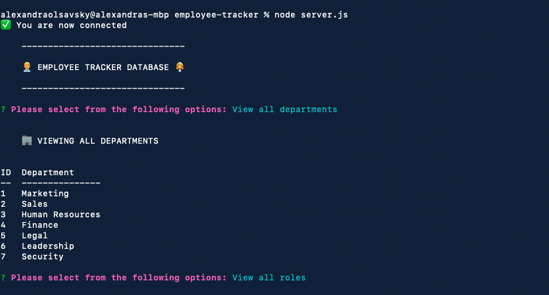
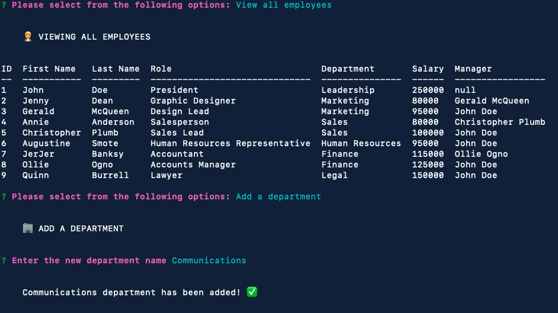

# Employee Tracker

  
  

  ## Description
  This is a command-line application that allows you to manage a company's database of employees. Requires use of Node.js, Inquirer, and MySQL.
  
  ## Table of Contents
  - [Installation](#installation)
  - [Usage](#usage)
  - [Contributing](#contributing)
  - [License](#license)
  
  ## Installation
  Clone the repository from GitHub. Install all modules in the package.json with `npm i`; To start application, run `node server.js`. NOTE - you will need to provide your own unique login credentials for the server to run.
  
  ## Usage
  You can view, add, and edit employees, roles, and departments. View walkthrough video [here](https://drive.google.com/file/d/1qHu8SXgKQXGtibfqxeXaAecW_aHC1rlD/view)

  
  
  
  ## License
  Read more about MIT here: [MIT](https://opensource.org/licenses/MIT)
  
  ## Contributing
  Please read the installation section.
  
  ## Tests
  There are no tests for this application.
  
  ## Questions
  - GitHub: [View my profile](https://github.com/ajolsavsky)
  - Email: alexandraolsavsky@gmail.com
  